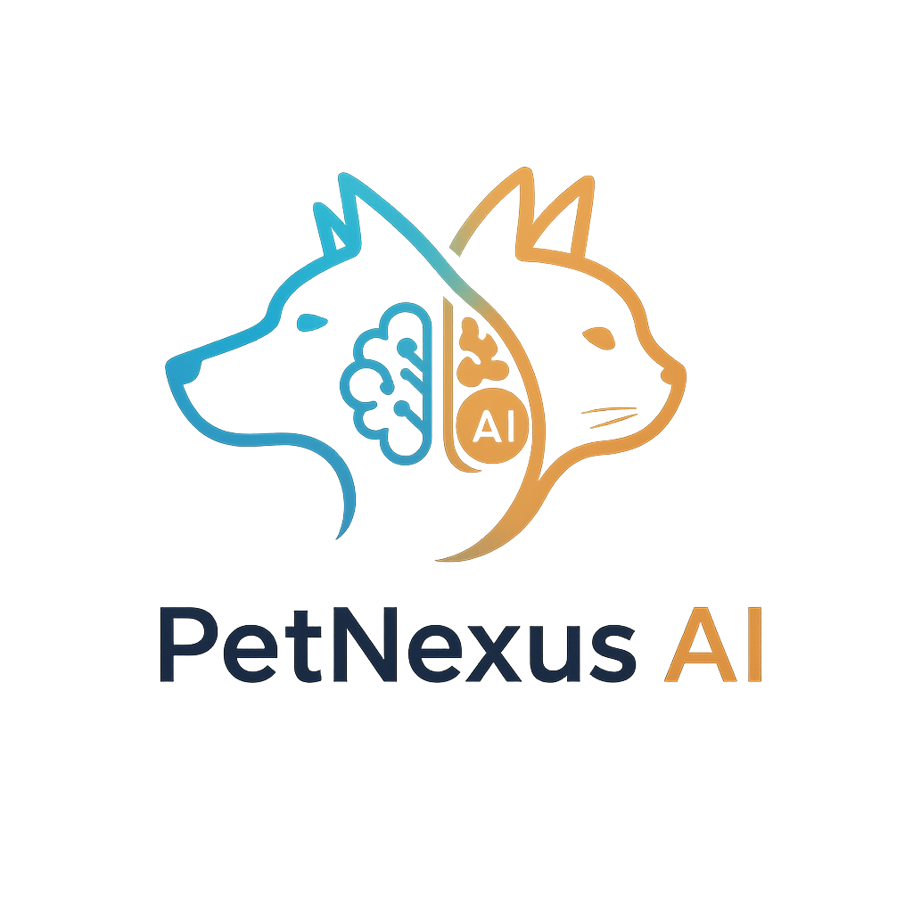
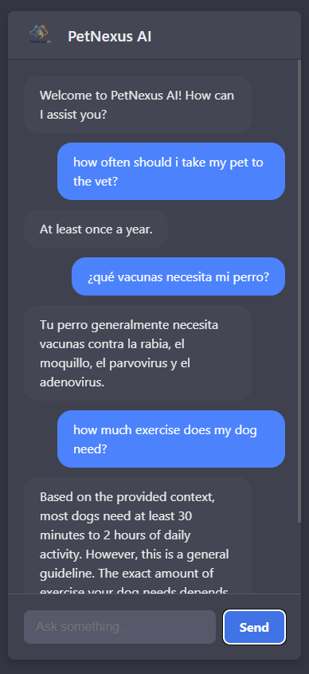

# PetNexus AI 🐾



**PetNexus AI** is an intelligent chat assistant designed to answer questions about pet care and health. The application features a secure authentication system and an interactive chat interface that connects with advanced language models like OpenAI and Gemini.

---

## 📸 Preview

| Login Page | Chatbot Session |
|------------|-----------------|
|  |  |

---

## ✨ Features

- **🔐 User Authentication:** Complete registration and login system with JWT security tokens.
- **💬 Modern Chat Interface:** A Single-Page Application (SPA) built with React, featuring a dark and intuitive design.
- **🤖 Dual AI Integration:** Connects to the OpenAI API as the primary provider and automatically uses the Gemini API as a fallback on failure.
- **🧠 Context-Aware Responses (RAG):** The bot uses a knowledge base to provide context to the AI models, generating more accurate and relevant answers.
- **🔒 Protected Routes:** The chat interface is only accessible to logged-in users.
- **🐳 Dockerized Environment:** The entire application (Java backend + PostgreSQL database) is orchestrated with Docker Compose for easy local setup.
- **🔄 CI/CD with Azure DevOps:** Includes a Continuous Integration pipeline configured in Azure DevOps to run tests automatically.

---

## 🛠️ Tech Stack

### Backend
- **Java 21**
- **Spring Boot 3**
- **Spring Security** (for JWT handling)
- **Spring Data JPA**
- **PostgreSQL**
- **Maven** (for dependency management)
- **Lombok**

### Frontend
- **React.js**
- **Vite** (as the build tool)
- **React Router** (for navigation)
- **Axios** (for API calls)
- **CSS3** (for custom styling)

### DevOps
- **Docker & Docker Compose**
- **Azure DevOps Pipelines** (CI)

---

## 🚀 Getting Started

Follow these steps to get the project running in your local environment.

### Prerequisites

- **Java 21** (or higher)
- **Maven 3.8** (or higher)
- **Node.js 20.x** (or higher)
- **Docker** and **Docker Compose**

### Local Installation & Setup

1.  **Clone the repository:**
    ```bash
    git clone <YOUR_REPOSITORY_URL>
    cd PetNexus-AI
    ```

2.  **Configure Environment Variables:**
    * In the project root, create a file named `.env`.
    * Copy the content from the example below and fill in your own keys.

3.  **Launch the Containers:**
    This command will build the Java application's image and launch both the app server and the database.
    ```bash
    docker-compose up --build
    ```
    The backend will be running at `http://localhost:8080`.

4.  **Install Frontend Dependencies:**
    * Open a **new terminal** and navigate to the frontend folder.
    ```bash
    cd frontend
    npm install
    ```

5.  **Run the Frontend:**
    ```bash
    npm run dev
    ```
    The web interface will be available at `http://localhost:5173`.

---

## ⚙️ Configuration (.env)

Create a `.env` file in the project root with the following content, replacing the placeholder values with your credentials:

```env
# PostgreSQL Credentials
POSTGRES_DB=petnexusdb
POSTGRES_USER=admin
POSTGRES_PASSWORD=your_strong_password

# JWT Secret Key
JWT_SECRET=your_super_secret_jwt_key_that_is_long_and_secure

# AI Provider API Keys
OPENAI_API_KEY=sk-xxxxxxxxxxxxxxxxxxxxxxxxxxxx
GEMINI_API_KEY=xxxxxxxxxxxxxxxxxxxxxxxxxxxx
```

---

## 📋 API Endpoints

- `POST /api/users/register`: Registers a new user.
- `POST /api/users/login`: Logs in a user and returns a JWT.
- `POST /api/chat`: (Protected) Sends a message to the chat and receives a response from the AI.