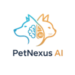
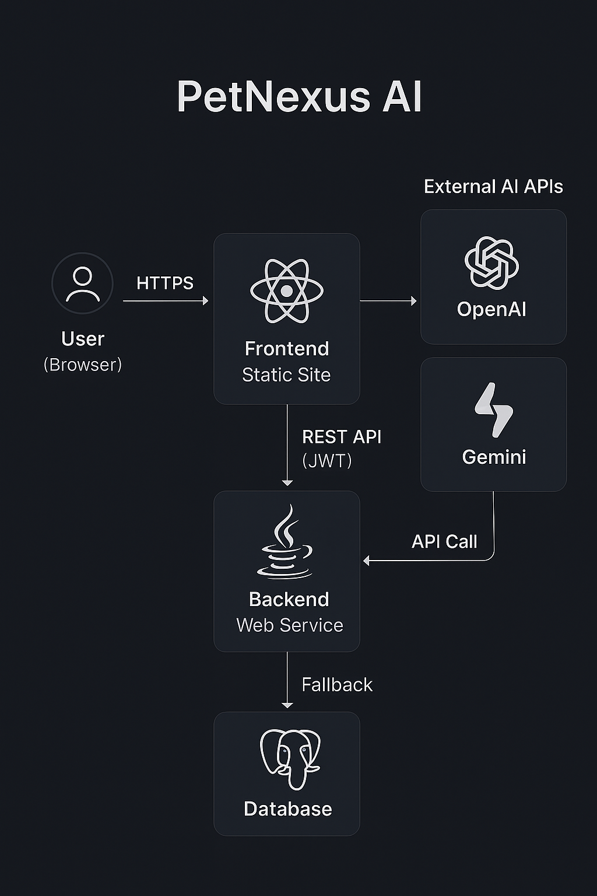
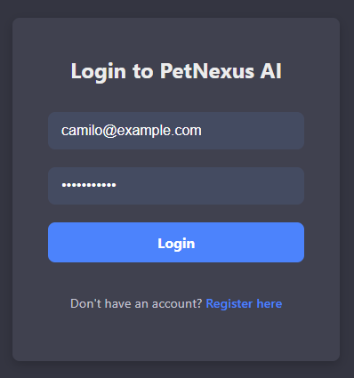
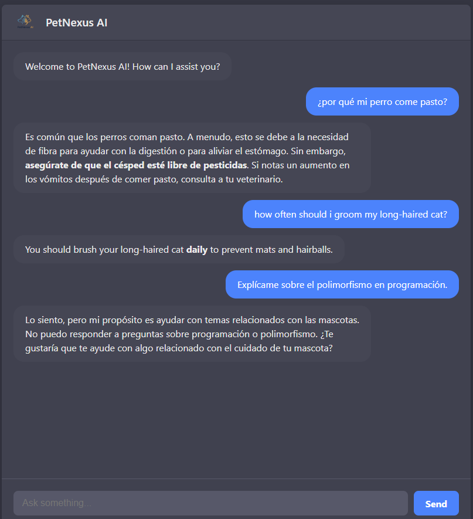
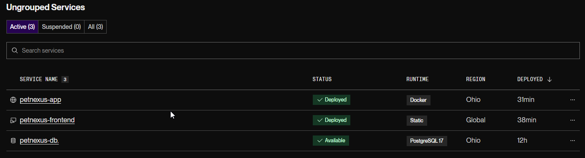

# PetNexus AI 🐾



PetNexus AI is a full-stack, AI-powered chat assistant designed to provide expert advice on pet care. This application features a secure user authentication system, a modern and responsive chat interface, and a robust backend that leverages multiple large language models to deliver accurate, context-aware answers. The entire application is containerized with Docker and deployed to the cloud using a CI/CD workflow.

---

## ✨ Live Demo

The application is fully deployed on Render:

- **Frontend (Static Site):** [https://petnexus-frontend.onrender.com](https://petnexus-frontend.onrender.com)
- **Backend (Web Service):** [https://petnexus-app.onrender.com](https://petnexus-app.onrender.com)

---

## 🚀 Features

- **🔐 Secure User Authentication:** Complete registration and login flow using JWT for secure, stateless authentication.
- **💬 Modern Chat UI:** A responsive Single-Page Application (SPA) built with React, featuring a professional dark theme, loading indicators, and Markdown rendering for bot responses.
- **🤖 Dual AI Integration with Fallback:** Integrates with the OpenAI API as the primary AI provider and automatically falls back to the Google Gemini API if the primary service fails, ensuring high availability.
- **🧠 Context-Aware Responses (RAG):** Implements a Retrieval-Augmented Generation (RAG) pattern. The backend fetches relevant context from a knowledge base (hosted on a Gist) to engineer more accurate and domain-specific prompts for the AI models.
- **🛡️ Persona & Guardrails:** The AI is instructed via a system prompt to adopt the persona of "PetNexus AI" and to politely decline questions outside the scope of pet care.
- **🔒 Protected Routes:** The frontend chat interface is protected and only accessible to authenticated users.
- **🐳 Fully Dockerized Environment:** The backend and PostgreSQL database are containerized using Docker and orchestrated with Docker Compose for consistent local development.
- **🔄 Continuous Integration & Deployment (CI/CD):**
    - **CI:** An Azure DevOps pipeline automatically runs all backend tests on every push to the main branch.
    - **CD:** Render's auto-deploy feature is configured to automatically build and deploy the frontend and backend services upon pushes to the connected GitHub repository.

---

## 🏛️ Architecture



This application is designed with a modern, decoupled full-stack architecture. The user interacts with a React Single-Page Application (SPA) which communicates with a backend REST API built with Spring Boot.

The backend handles all business logic, including user authentication (JWT) and data persistence with a PostgreSQL database. For chat functionality, the backend orchestrates calls to external large language models (OpenAI and Gemini) using a fallback mechanism to ensure high availability.

---

## 🛠️ Tech Stack

### Backend
- **Java 21** & **Spring Boot 3**
- **Spring Security** (JWT Authentication)
- **Spring Data JPA** & **Hibernate**
- **PostgreSQL**
- **Maven** & **Lombok**
- **RestTemplate** for external API calls

### Frontend
- **React.js** & **Vite**
- **React Router** for client-side routing
- **Axios** for API communication
- **React-Markdown** for rich text rendering
- **React-Spinners** for loading state UX

### DevOps & Cloud
- **Docker** & **Docker Compose**
- **Azure DevOps** for Continuous Integration (CI)
- **Render** for Cloud Hosting (Static Site, Web Service, PostgreSQL)
- **Git** & **GitHub** for version control and deployment triggers

---

## ⚙️ Local Development Setup

### Prerequisites
- Java 21+ & Maven 3.8+
- Node.js 20.x+
- Docker & Docker Compose

### 1. Configure Environment Variables
In the project root, create a file named `.env` and add the following content, replacing placeholder values with your credentials:
```env
# PostgreSQL Credentials for Docker Compose
POSTGRES_DB=petnexusdb
POSTGRES_USER=admin
POSTGRES_PASSWORD=your_strong_password

# JWT Secret Key
JWT_SECRET=your_super_secret_jwt_key_that_is_long_and_secure

# AI Provider API Keys
OPENAI_API_KEY=sk-xxxxxxxxxxxxxxxxxxxxxxxxxxxx
GEMINI_API_KEY=xxxxxxxxxxxxxxxxxxxxxxxxxxxx
```

### 2. Run the Backend & Database
This single command will build the backend Docker image and start the Spring Boot and PostgreSQL containers.
```bash
docker-compose up --build
```
The backend API will be available at `http://localhost:8080`.

### 3. Run the Frontend
1.  Navigate to the frontend directory in a new terminal:
    ```bash
    cd frontend
    ```
2.  Install dependencies:
    ```bash
    npm install
    ```
3.  Create a local environment file `frontend/.env`:
    ```env
    VITE_API_URL=http://localhost:8080
    ```
4.  Start the development server:
    ```bash
    npm run dev
    ```
The frontend will be available at `http://localhost:5173`.

---

## 🧪 Testing

The project includes a suite of automated tests for the backend.
- **Unit Tests:** Mockito is used to test services in isolation, including the AI service orchestrator and its fallback logic.
- **Integration Tests:** MockMvc is used to test the full request/response cycle for secured controllers.

To run all tests, execute the following command from the project root:
```bash
mvn test
```

---

## 🖼️ Screenshots

**Login & Registration**
*A clean and responsive form for user authentication.*


**Chat Interface**
*The main chat view, showing a conversation with the AI, Markdown rendering, and loading indicators.*


**Deployed Services on Render**
*The three services (Database, Backend, Frontend) running successfully on the Render dashboard.*
